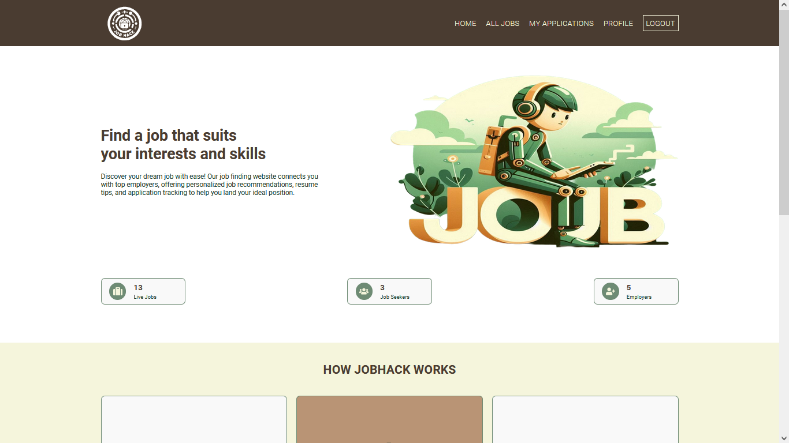
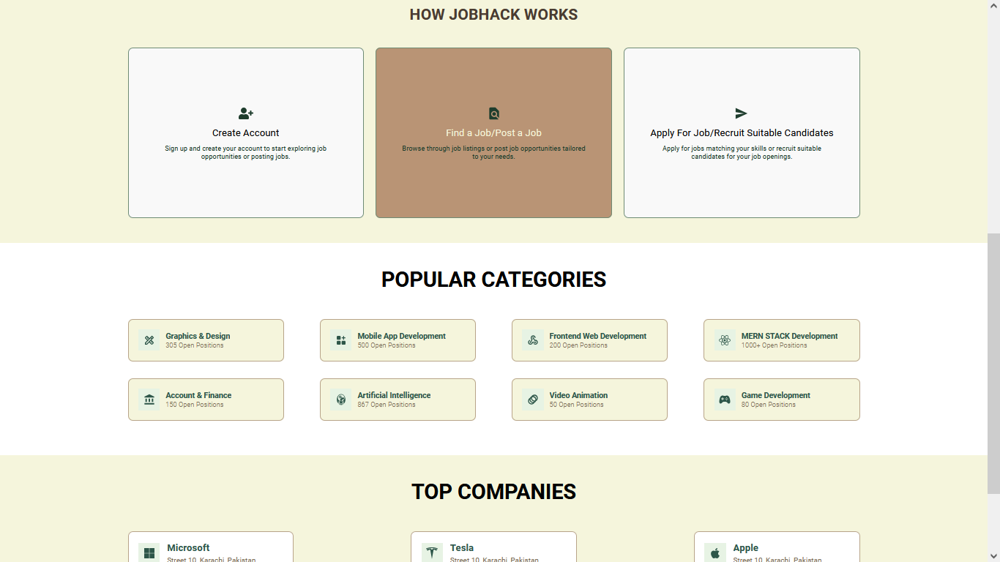

# JOBHACK

JOBHACK is a comprehensive job application platform that allows users to register, log in, post jobs, and apply for jobs. The platform is built with a robust tech stack, including React.js for the frontend and Node.js with Express.js for the backend. The project is deployed with the frontend on Netlify and the backend on Render.

## Table of Contents

- [Features]
- [Tech Stack]
- [Installation]
- [Usage]
- [API Endpoints]
- [Environment Variables]
- [File Structure]
- [Deployment]

## Features

- User Authentication
  - Register
  - Login
  - JWT-based authentication
- Job Listings
  - View all jobs
  - View job details
  - Post a job (Employer)
  - Manage posted jobs (Employer)
- Job Applications
  - Apply for jobs (Job Seeker)
  - View and manage applications (Job Seeker)
  - View applications for posted jobs (Employer)
- Notifications using React Hot Toast
- Role-based access control

## Tech Stack

**Frontend:**
- React.js
- React Router
- Axios
- React Context API
- React Hot Toast

**Backend:**
- Node.js
- Express.js
- MongoDB
- Mongoose
- JWT
- dotenv
- cors
- cookie-parser
- express-fileupload

**Deployment:**
- Frontend: Netlify
- Backend: Render

## Installation

### Prerequisites

- Node.js
- MongoDB

### Backend Setup

1. Clone the repository:
   ```bash
   git clone https://github.com/your-username/jobhack.git
   cd jobhack/backend
   ```

2. Install dependencies:
   ```bash
   npm install
   ```

3. Create a `.env` file in the `backend` directory and add your environment variables:
   ```env
   PORT=3000
   MONGO_URI=your_mongodb_uri
   JWT_SECRET_KEY=your_jwt_secret_key
   COOKIE_EXPIRE=7
   ```

4. Start the backend server:
   ```bash
   npm start
   ```

### Frontend Setup

1. Navigate to the `frontend` directory:
   ```bash
   cd ../frontend
   ```

2. Install dependencies:
   ```bash
   npm install
   ```

3. Create a `helper.js` file in the `frontend/src` directory and add your base URL:
   ```js
   export const BASE_URL = "http://localhost:3000";
   ```

4. Start the frontend development server:
   ```bash
   npm start
   ```

## Usage

1. Register a new user or log in with an existing account.
2. As an employer, you can post new jobs and manage your posted jobs.
3. As a job seeker, you can view job listings, apply for jobs, and manage your applications.

## API Endpoints

### User Routes

- `POST /api/v1/user/register` - Register a new user
- `POST /api/v1/user/login` - Login a user
- `GET /api/v1/user/getUser` - Get the current authenticated user

### Job Routes

- `GET /api/v1/job/getAll` - Get all job listings
- `GET /api/v1/job/:jobId` - Get a specific job's details
- `POST /api/v1/job/post` - Post a new job (Employer only)
- `PUT /api/v1/job/update/:jobId` - Update a job (Employer only)
- `DELETE /api/v1/job/delete/:jobId` - Delete a job (Employer only)
- `GET /api/v1/job/me` - Get jobs posted by the authenticated employer

### Application Routes

- `POST /api/v1/application/apply/:jobId` - Apply for a job (Job Seeker only)
- `GET /api/v1/application/getAll` - Get all applications for the authenticated user
- `DELETE /api/v1/application/delete/:id` - Delete an application (Job Seeker only)

## Environment Variables

The following environment variables need to be set in your `.env` file:

- `PORT`: The port on which the backend server will run.
- `MONGO_URI`: The MongoDB connection URI.
- `JWT_SECRET_KEY`: The secret key for signing JWT tokens.
- `COOKIE_EXPIRE`: The number of days until the JWT token expires.

## File Structure

### Frontend

- `src/`
  - `components/`
    - `Auth/` (Login, Register components)
    - `Layout/` (Navbar, Footer components)
    - `Home/` (Home component)
    - `Job/` (Jobs, JobDetails, PostJob, MyJobs components)
    - `Application/` (Application, MyApplications components)
    - `NotFound/` (NotFound component)
  - `App.js` (Main app component with routing)
  - `main.jsx` (React Context provider setup)
  - `helper.js` (Utility functions and constants)

### Backend

- `routes/`
  - `userRouter.js` (User-related routes)
  - `jobRouter.js` (Job-related routes)
  - `applicationRouter.js` (Application-related routes)
- `middlewares/`
  - `error.js` (Error handling middleware)
  - `headers.js` (Headers middleware for CORS and other configurations)
- `controllers/`
  - `userController.js` (Handles user-related logic)
  - `jobController.js` (Handles job-related logic)
  - `applicationController.js` (Handles application-related logic)
- `models/`
  - `userSchema.js` (Mongoose schema for users)
  - `jobSchema.js` (Mongoose schema for jobs)
  - `applicationSchema.js` (Mongoose schema for applications)
- `utils/`
  - `jwtToken.js` (JWT token handling logic)
  - `catchAsyncError.js` (Utility to catch async errors in route handlers)
  - `error.js` (Custom error class)
- `config/`
  - `config.env` (Environment variables)

## Deployment

### Netlify (Frontend)

1. Create a `netlify.toml` file in the root of your frontend directory:
   ```toml
   [build]
     base = "frontend"
     publish = "dist"
     command = "npm run build"

   [[redirects]]
     from = "/*"
     to = "/index.html"
     status = 200
   ```

2. Push your frontend code to a Git repository.

3. Login to Netlify and create a new site from your Git repository.

4. Netlify will automatically detect the `netlify.toml` file and deploy your site.

<br/>

<br/>


### Render (Backend)

1. Push your backend code to a Git repository.

2. Login to Render and create a new web service.

3. Connect your Git repository and configure the environment variables.

4. Deploy the service.
